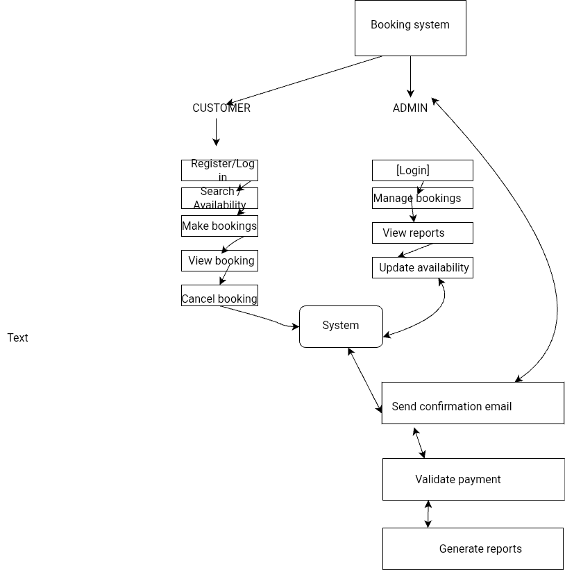

Requirement Analysis in Software Development
What is Requirement Analysis?

its a critical phase in the software development lifecycle (SDLC) where the needs, expectations, and constraints of a software product are thoroughly studied and documented. This process involves gathering information from stakeholders—such as clients, end-users, and system analysts—to understand what the software must accomplish. The outcome of this phase includes detailed functional and non-functional requirements that serve as the foundation for system design, development, testing, and deployment. Techniques used in requirement analysis include interviews, questionnaires, use cases, and workflow analysis to ensure that every aspect of the user’s needs is captured and clearly understood.

The importance of requirement analysis lies in its ability to reduce the risk of project failure due to misunderstood or incomplete requirements. It ensures that all stakeholders have a shared understanding of the software’s goals and scope, preventing costly changes later in the development process. A well-conducted requirement analysis helps in building a product that meets user expectations, stays within budget, and is delivered on time. By identifying potential issues early, such as conflicting requirements or technical limitations, this phase significantly contributes to the overall success and quality of the final software product.
Significance of Requirement Analysis lies in its role as the foundation for successful software development. It ensures that developers fully understand what the client or end-user needs from the system before any design or coding begins. This process minimizes the chances of building software that is off-target, incomplete, or misaligned with business objectives. Clear and accurate requirements help guide the development team, reduce ambiguity, and establish a shared vision among stakeholders.

Additionally, requirement analysis helps in identifying potential risks, estimating time and cost accurately, and setting realistic expectations. It aids in managing changes effectively by providing a clear baseline of what the system is supposed to do. Without solid requirement analysis, projects often face delays, cost overruns, and user dissatisfaction. Therefore, it is a vital step in delivering a high-quality product that meets both technical and business needs.
Key Activities in Requirement Analysis.
Requirement Gathering involves collecting information from stakeholders to understand what the software system should accomplish.

Requirement Elicitation focuses on actively engaging with stakeholders through techniques like interviews and workshops to uncover their needs and expectations.

Requirement Documentation is the process of recording the gathered requirements in a structured format for reference and communication.

Requirement Analysis and Modeling involves examining and organizing requirements to identify relationships, conflicts, and priorities, often using diagrams or models.

Requirement Validation ensures that the documented requirements accurately reflect stakeholder needs and are complete, consistent, and feasible.
Types of Requirements

. Functional Requirements
Functions the system must perform.

Users can create, view, and cancel bookings.

Admin can manage all bookings.

System sends confirmation emails.

Users can search bookings by date or name.

2. Non-Functional Requirements
How the system performs tasks.

System must load pages within 2 seconds.

Available 99.9% of the time.

Supports 10,000 users at once.

Data must be encrypted.

Mobile-friendly interface.

Use Case Diagrams are visual 
representations of how users interact with a system to achieve specific goals.

Benefits

Simplify system requirements.

Show user-system interactions clearly.

Help identify system functionality.

Aid communication between stakeholders.

Why is Requirement important
It is  is important because it ensures the software meets user needs, prevents costly errors, and guides the entire development process with clear goals.

Activities in Requirement Analysis 
Requirement Gathering
Collecting information from stakeholders about their needs and expectations.

Requirement Elicitation
Using interviews, surveys, or workshops to draw out detailed requirements.

Requirement Documentation
Recording the gathered requirements clearly for reference and development.

Requirement Analysis and Modeling
Organizing, analyzing, and creating models to understand requirements better.

Requirement Validation
Checking if the documented requirements are complete, correct, and aligned with user needs.

List and describe at least three key reasons why Requirement Analysis is critical in the SDLC.
Reasons Why Requirement Analysis is Critical in SDLC
Prevents Miscommunication
It ensures all stakeholders have a clear, shared understanding of what the system should do.

Reduces Development Errors
By identifying requirements early, it helps avoid costly mistakes and rework during later stages.

Improves Project Planning
Clear requirements allow for accurate time, cost, and resource estimation, leading to better project management.

Activities in Requirement Analysis
Requirement Gathering
Collecting information from stakeholders about their needs and expectations.

Requirement Elicitation
Using interviews, surveys, or workshops to draw out detailed requirements.

Requirement Documentation
Recording the gathered requirements clearly for reference and development.

Requirement Analysis and Modeling
Organizing, analyzing, and creating models to understand requirements better.

Requirement Validation
Checking if the documented requirements are complete, correct, and aligned with user needs.
Types of Requirements
Functional Requirements
Describe what the system should do—its features and functions.
Example: "The system shall allow users to make bookings."

Non-Functional Requirements
Define how the system performs tasks—quality attributes like speed, security, and usability.
Example: "The system should load all pages within 2 seconds."

Business Requirements
High-level goals or needs of the organization behind the project.
Example: "Increase online booking rates by 30% in six months."

User Requirements
Specific needs or expectations of the end-users interacting with the system.
Example: "Users should be able to cancel a booking through their dashboard."

System Requirements
Detailed technical specifications needed to build and run the system.
Example: "The system must run on Windows Server and support MySQL."

Importance of Acceptance Criteria in Requirement Analysis
Acceptance criteria define the conditions a requirement must meet to be considered complete and acceptable by stakeholders. They are important because:

Ensure clarity: They remove ambiguity by setting clear expectations for each requirement.

Guide development and testing: They help developers know when a feature is done and testers know what to validate.

Reduce misunderstandings: They align stakeholders, developers, and testers on what success looks like.

Improve quality: They ensure requirements meet user needs before approval or release.

User must be logged in to access the booking page.

User must be able to select a service, date, and time from available options.

The system must prevent double-booking for the same slot.

User must receive a booking summary before confirming.

A confirmation message must appear after booking is submitted.

https://app.diagrams.net/#G11XEN5J6VczJa2jGkwNW_Iv7JRmKQCU0_#%7B%22pageId%22%3A%22las4vqeujMak7hbAGnB7%22%7D

